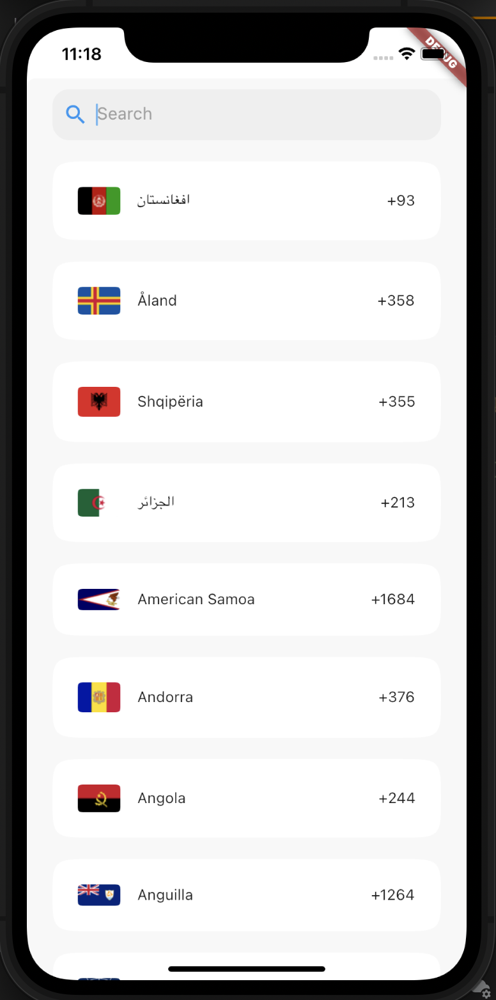

[](https://pub.dartlang.org/packages/country_pick_screen)

# country_pick_screen

A flutter package for showing a country pick screen, you can implement your own item UI

It supports i18n for 70 languages.

## Demo


### i18n

Just add the `CountryLocalizations.delegate` in the list of your app delegates

```dart
 return new MaterialApp(
      supportedLocales: [
         Locale("af"),
        Locale("am"),
        Locale("ar"),
        Locale("az"),
        Locale("be"),
        Locale("bg"),
        Locale("bn"),
        Locale("bs"),
        Locale("ca"),
        Locale("cs"),
        Locale("da"),
        Locale("de"),
        Locale("el"),
        Locale("en"),
        Locale("es"),
        Locale("et"),
        Locale("fa"),
        Locale("fi"),
        Locale("fr"),
        Locale("gl"),
        Locale("ha"),
        Locale("he"),
        Locale("hi"),
        Locale("hr"),
        Locale("hu"),
        Locale("hy"),
        Locale("id"),
        Locale("is"),
        Locale("it"),
        Locale("ja"),
        Locale("ka"),
        Locale("kk"),
        Locale("km"),
        Locale("ko"),
        Locale("ku"),
        Locale("ky"),
        Locale("lt"),
        Locale("lv"),
        Locale("mk"),
        Locale("ml"),
        Locale("mn"),
        Locale("ms"),
        Locale("nb"),
        Locale("nl"),
        Locale("nn"),
        Locale("no"),
        Locale("pl"),
        Locale("ps"),
        Locale("pt"),
        Locale("ro"),
        Locale("ru"),
        Locale("sd"),
        Locale("sk"),
        Locale("sl"),
        Locale("so"),
        Locale("sq"),
        Locale("sr"),
        Locale("sv"),
        Locale("ta"),
        Locale("tg"),
        Locale("th"),
        Locale("tk"),
        Locale("tr"),
        Locale("tt"),
        Locale("uk"),
        Locale("ug"),
        Locale("ur"),
        Locale("uz"),
        Locale("vi"),
        Locale("zh")
      ],
      localizationsDelegates: [
        CountryLocalizations.delegate,
        GlobalMaterialLocalizations.delegate,
        GlobalWidgetsLocalizations.delegate,
      ],
```

## Contributions

Contributions of any kind are more than welcome! Feel free to fork and improve country_pick_screen in any way you want, make a pull request, or open an issue.
